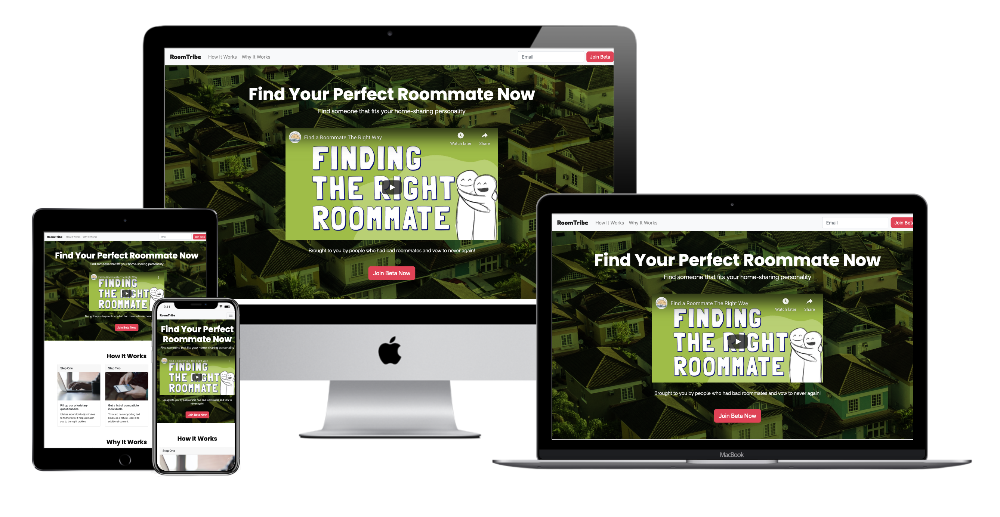

# Context

As part of my Code Institute Full Stack Developer bootcamp course, I created this one-pager website for an imaginary startup to get beta users to sign up. Such landing pages are often created by startups to help test and validate their ideas during their problem discovery stages. 

You can access the website here:
https://edmundgjj.github.io/codeinstitute-proj1/index.html#

# UX/UI 

## Information Structure / Flow

This is a one page website with the following sections:
- Hero Banner - To effectively communicate the value proposition of the product and what the site is trying to achieve. I added a placeholder video. Ideally, the video would be one to show how the service works but I could not make it in time. As such, I have used a video about problems faced finding roommate as a placeholder. 
- How It Works - Explain briefly how the service will work from the user perspective
- Why It Works - Build trust with the user on why the service will work 
- Call To Action to Join Beta - As per the serial position effect, users are more likely to remember things at the start and end of the page. Reminding the user to join the beta at the bottom is also timely as they have already read the content of the site and have a good understanding of the service's offering. 

## Target Audience
* People who has problem looking for compatible roommates 
* People who are exploring the idea of sharing their apartment or home but don't know if they can trust strangers
* Targeted towards people who are in their early days of joining the workforce and are not able to own a home as yet. 

## Navigation
* As a relatively short and concisce web page, the users simply have to scroll through vertically to read all the content of the website. 
* I included a navigation bar for the users to jump to the relevant sections of How It Works and Why It Works. 

## Responsiveness

Using bootstrap and its grid system, the site is responsive for both desktops, laptops and mobile phones.

## Colours

I have chosen green as the main color template as it is to exude neutrality and harmony like nature.  
Bright pink color is used for the CTA as it is a great contrast with green and adds a touch of playfulness to the theme. 

## Testing 

I tested the site on these devices and browsers: 
- Macbook Pro 16 Inch, Mac OSX 10.15.16 using Safari and Chrome. 
- Iphone 11 Pro Max, iOS 13.31.1 on Safari and Chrome. 

The test included: 
- The website loaded with all sections displayed as per designed. 
- The navigation links brought the user to the right section. 
- The navigation bar was responsive and collapsed into a hamburger toggle on mobile. 
- The buttons were clickable on mobiles and had hover effect on desktops.  

## Technology

* Bootstrap version 4.4</a>
* HTML 
* CSS
* Javascript 
* JQuery

## Reference / Credits
* Video - https://www.youtube.com/embed/fhuA2Z4GFI0 from watchwellcast, youtube channel

